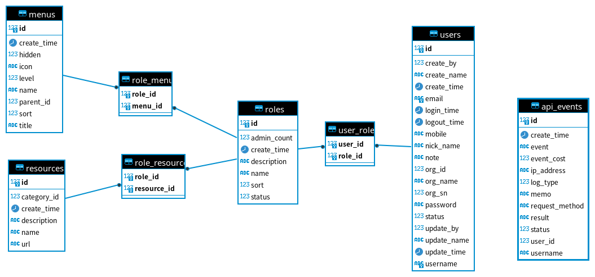

# Spring Boot 3 JWT Authentication Project

username/password kevin/1234567
## Introduction
- it is spring boot backend project
- it is a basic security template project

## Program

- using spring boot 3 + security + jwt 
- using StopWatch for monitor api performance
- using JPA
- 

## Function
- SecurityFilterChain 白名單url (application.yml url-config)
- api event records (ipAddress,UserAgent,Method... )
- Global cors disabled

## ER Model
user account / role / menu / api privilege relation 

## User Registration, User Login and Authorization process

## Spring Boot Server Architecture with Spring Security
